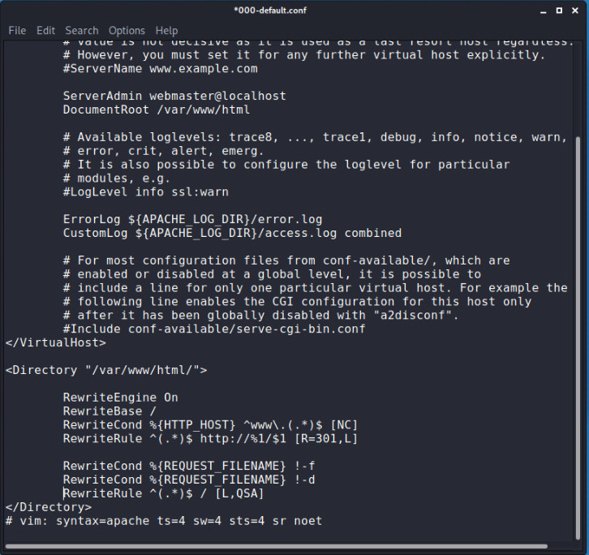

# Wifi-Cracking (Part-3) [ CAPTIVE PORTALS /FAKE ACCESS POINT]


Lets move directly to the  **CAPTIVE PORTALS**  this are usually the open wifi networks, widely used in hotels, airports, coffeeshops etc.They allow users to access the internet after logging in using **web interface**.

In general when you try to connect with this types of networks your web browser pops up the login  page  just like this.


There are number of ways to to bypass captive portals:

1. Change MAC Address to one of a connected client
2. Sniffing in monitor mode
3. Connect and sniff login after running **arp spoofing** attack
4. Create a fake AP, ask user to login

---
The first method is very much easy and we have discussed this in our previous writeups, just use **airodump-ng** to the target network see all the clients and use **macchanger**  to change MAC Address of your wireless adapter to the same as one of the connected client easy peasy you get access but sometimes it may be suspicious because there will two device with same MAC Address on that network . So lets talk about some more methods.

---
Since captive portals are open and they don't use any encryption unless data is sent over **https** so we can easily sniff data sent to/from it by using **airodump-ng** and then use **Wireshark** to read all data including password.

```bash
root@kali:~# ifconfig wlan0 down
root@kali:~# ifconfig wlan0 mode monitor
root@kali:~# ifconfig wlan0

```

**NOTE: Set your wirelass card in monitor mode**

```bash
root@kali:~# airodump-ng wlan0

```
Select the OPN network which is your target and paste bssid and channel respectively for it  and use write to capture all the data in the file named KEY

```bash
root@kali:~# airodump-ng --bssid          --channel   --write KEY  wlan0

```

See now simply just need to deauthenticate any of the client which is conneted to that portal by

```bash
root@kali:~# aireplay-ng --deauth 10000 -a (MAC ADDRESS OF TARGET ACCESS POINT) -c (MAC ADDRESS OF MACINE TO DISCONNET) wlan0

```
we have discussed this attack many times even in more details so just see our previous blog posts or details deauthentication attack post in which  I have  explained it in depth.

And then wait for the client to once again connect with router and when clients connect to it, Simply open Wireshark and search for the file **KEY.cap** and use filter **http** because logins forms are sent over it search then for operation like login or sign in   and there you will get your password.


---
Lets approach to some more easier technique wihich is using **arp spoofing** you can use the classic  **mitm  arp spoofing** technique if you know that and if you don't see our posts on arp-spoofing for detailed info but I am going to use one of coolest tool for this attack which is **ettercap**

```bash
root@kali:~# ettercap -Tq -H arp:remote -i wlan0 ///

```
> You can see details for ettercap tool in bash by help command we are using it in arp mode and we use /// to work on all the clients conneted  to that network

So what happens when you run the above command  all clients are disconnected from the networks and when anyone try to login
to the captive portal the data will be redirected to us and all credentials will be displayed to your terminal you even don't need to search  unlike in Wireshark.

---

If all the above attacks are not successful than the only opting is to create fake Access point with the same name of captive portal but for these you must some basic knowledge of (html/css/js) to do exact copy of login portal and after creating a clone of the portal deauthenticate an user use your fake network with the cloned page and sniff the login credentials.

STEP 1: Cloning the login page used by the captive portals
- Open the  portal page  in your respective browser
- Press 'alt' for menubar go to file and select 'save page as' and download it in your desired location
  - generaly there will be two files one webpage(html file rename it (index.html) ) and a folder(for styling and images)
- go to 'var/www/html' and paste the index.html file and folder and remove all other html file and other files also and  than start your server by:

```bash
root@kali:~# service apache2 start

```
(If you go to your own IP Address or 127.0.0.1 the downloaded cloned login page will be displayed )

**NOTE: See there are lot of different login pages examples so we cannot illustrate each and every page in general you need to
make some slight changes in html/css code to bring perfection in that login page and make changes in favourite editor save it and try to make exact copy**

**In general for relative url  in the webpage you have to add  '/' at the very begining of every url <link href="/..." these things vary too much sometimes its not required**

One most important thing is you also need to add *form* tag if its not their for this you need to right click or go to  developer tools  inspect or search for the *input* tags where user enter the credentials if you find it inside  the **<form>** tag  than it good  enough and if not add it like **<form method="post" action="index.html">** this and don't forget to close the form tags.

>If you are new to these things and not getting what the hell we are doing just see our EVIL TWIN post there we used a tool named 'fluxion' to create fake access point which do these heavy lifting for us .

You also need to manipulate login button open the index.html file in your editor either it will be in *span* tag or *button* just remove those tags and add it in **<input style=" ....." type="submit" value="Log In">** see styling(css/sass) totaly depends on you how prefect you can clone it .

Now our webpage is cloned we need to create a **fake AP** with same you can do this with the help of **mana toolkit** or **airbase-ng**  but here I am going to illustrate the manual method to create  a fake AP which is faster than all of this all tools are based on this concept.

The main components of a wifi network are:

|          COMPONENTS                  | TOOLS WE WILL BE USING     |
| :------------------------------------| :------------------------- |
| A router broadcasting signal         |  Wifi card with  hostapd   |
| A DHCP server to give IP's to client |  dnsmasq                   |
| A server to handle DNS request       |  dnsmasq                   |

STEP 2:

Lets install the

```bash
root@kali:~# apt-get install hostapd dnsmasq

```

after installing the tools make sure to connect your wireless card and check by 'ifconfig' and follow further steps.

```bash
root@kali:~# service network manager stop
root@kali:~#

```

Sometimes while creating the fake AP you may get an error related to iptables so we running some commands to flush it.

**NOTE: We need configuration files for hostapd and dnsmasq you can get the configuration file from our [Github](https://github.com/noob-atbash) repo just download it and keep this in folder to illustrate further attack I have kept my conf file in the folder named fake-ap
(/root/Downloads/fake-ap) feel free to set your own folder name but be careful while running commands.**

Before starting  **dnsmasq**. we need you go to your downloads directory and and in the folder where we kept our  'dnsmasq.conf' file and  customize up to your requirements  and  incase you don't understand what to do in there their is an detailed explanation of .conf file inside it.

```bash
root@kali:~# dnsmasq -C /root/Downloads/fake-ap/dnsmasq.conf

```

Once it's  started we need to  do same thing for our **hostapd**  configuration file  go to your downloads directory and the folder open 'hostapd.conf' file and  customize the  **ssid** parameter (set ssid name to same as captive portal you are targeting ) because when they won't be able to connect to there original network they will try to connect to our fake AP of the same name so after setting the config file start it by

```
root@kali:~# dnsmasq -C /root/Downloads/fake-ap/hostapd.conf -B

```
(-B FOR BACKGROUND EXECUTION)

```
root@kali:~# ifconfig

```
Check  wether you got the new ip address and netmask according to **hostapd.conf** If yes feel free to move ahead and if not run the below commands:

```bash
root@kali:~# ifconfig wlan0 (Ip ADDRESS as give inhostapd.conf file)  netmask 255.255.255.0 (bydefault its same for all)

```
e.g

```bash
root@kali:~# ifconfig wlan0 10.0.2.1  netmask 255.255.255.0

```

Start your cloned we login page for
```bash
root@kali:~# service apache2 start

```

 Now if you see all  wifi networks your fake AP will be their with other networks it will work fine if you try to connect it and when you start web surfing it will ask to login first, Yes we got our fake AP running smoothly but still it will refuse to load  and also  request are sent by different systems (depends on OS) are not handled properly  in order to fix this all we first need to redirect all requests starting with 'www' to be handled only by its domain for example "www.yahoo.com" > "yahoo.com" for this we need to set some rule in our server configuration file in order to open that :

 ```bash
root@kali:~# leafpad /etc/apache2/sites-enabled/000-default.conf

 ```
 

 this will be open in order to add some rules first add <Directory> as shown in below image:


Now to handel(404) error  page  for all systems (Except ios device ) add rule at top as shown in image:


In order to handel error for ios device write the below rules shown in image you can find all these rules in our Github repo.



Restart your server

```bash
root@kali:~# service apache2 restart

```

Now our fake AP can handel all requests and error from different the only problem we left out is sites which uses https
we also need to add https to our own server, so we are going to generate a fake SSL certificate by:

```bash
root@kali:~# openssl req -new -x509 -day 365 -out /root/Downloads/fake-ap/cert.pem -keyout /root/Downloads/fake-ap/cert.key

```
---
BREAKDOWN (for above command):

openssl: use to create ssl certificate
-new : for network
-x509: general used structure for certificate
365: valid for 1 year

Saving the certficate in root/Downloads/fake-ap/cert.pem and key in -keyout /root/Downloads/fake-ap/cert.key

---

After hitting enter it will ask for key (set as you desire)and  some general ques to generate certficate like (country, locality, domain ....etc >name) after all this certficate will be generated at your given location after this enable ssl by

```bash
root@kali:~#  a2enmod ssl

```
Once again open :

```bash
root@kali:~# leafpad /etc/apache2/sites-enabled/000-default.conf

```

If you notice <Virtualhost 80> is running for http and to enable ssl just add one more <Virtualhost> tag as shown in image:


```bash
root@kali:~# leafpad /etc/apache2/ports.conf

```
TO add port for ssl sometimes it's already writen there :


thats all ! Restart server once again with all lopehole covered ready to handle all https and http request also with error(404) pages to :

```bash
root@kali:~# service apache2 restart

```
Now we covered each loopholes for our fake AP run the final step.

STEP 3:

Run a deauthentication attack on any client on that network for a long time  so when user is unable to connect to the original network he will try connect to our fake AP and for that we will sniffing the data using Wireshark.

```bash
root@kali:~# tshark -i wlan0 -w key.cap

```
(we are writing our captured data in the file named key.cap) and when user connects to our fake AP by there login credentials we get the username and password for this you just open the 'key.cap' file in wireshark use filter 'http'
inside that search for post request inside that you will get credentials.


>I know this process is quite long and little bit difficult to understand, Yes we can use any specific tool which do all this heavy liftings for us  but the purpose behind this post was to make you aware on the core concept of fake  ACCESS POINT and all those tools are also built on this concept only, and by using the concept of fake access point cracking of WPA Enterprise become easy.
