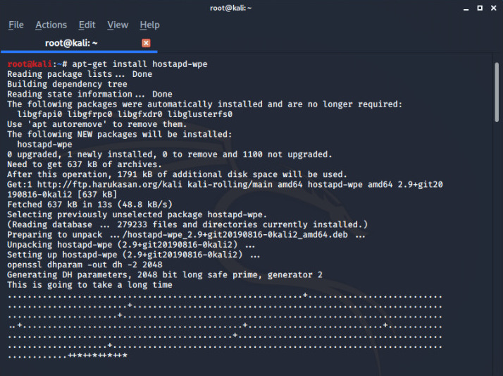
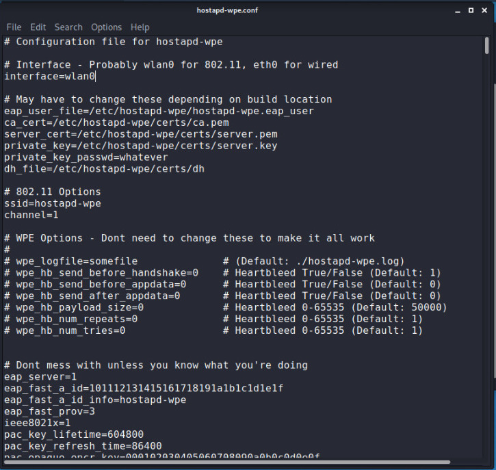

# Wifi-Cracking (Part-4) [WPA ENTERPRISE]

In our earlier writeups I have discussed how to gain access on WPA/WPA2 networks so all WPA/WPA2 networks use PSK(pre shared key) authetication there is only one key which is used to authenticate users and router manages authetication so in this post we are going discusse on **WPA ENTERPRISE** which is an another form of authentication as from name we can depict thats is is used on large scale like universities but here each user get their **own** key to connect to the network which makes it more secured because traffic encrypted for each user is based on their unique key and if you want to remove any specific user you don't need to change the key of router just remove there key from authentication server  and authetication is managed through through a **central server**.

So if we open any **WPA ENTERPRISE** network in Windows machine a login box will open in your network tab and in case MAC OSX the login box pops up on the desktop screen so here we find some similarties with 'captive portal' there also we find a login page in web browser instead on tab or desktop.

> Give a read to our captive portal and evil twin post because we are going to use some of the concepts and tools from their.

Let discuss what are the problems we will face to gain access WPA ENTERPRISE:
- Encryption is used so we can't sniff credentials in monitor mode.
- Can't use ARP spoofing because it's a post connection attack so we need to connect first.

The only way to crack this is use to run evil twin attack for this we need our traditional method just to clone the login box and create a fake AP that use a WPA enterprise, since we already created a fake AP in captive portal blog guve it read because the process will be same but the only difference will be instead of login page we will be cloning a login box and for this we need the modified version of **hostapd**.

```
root@kali:~# apt-get update
root@kali:~# apt -get install hostapd-wpe

```



afte installing the tool you need to make some changes in the configuration file for the tool as similar we have done in the case of captive portal.

```
root@kali:~# leafpad /etc/hostapd-wpe/hostapd-wpe.conf

```


It will open the .conf file the main concern here is just to confirm the name of **interface** by default it is wlan0 check yours by
ifconfig and second set **ssid** by removing the default and set it same as the name of the of your target WPA ENTERPRISE, after configuring this parameter start the hostapd-wpe

```
root@kali:~# hostapd-wpe /etc/hostapd-wpe/hostapd-wpe.conf

```

This will start your tool now run  deauthenticate  attack either all users or any specific user any when any user enter the login credentials three main parametes username, challenge and response the central server will send the challenge which is encrypted (encryption name is also displayed the below the response ) in order to get the key we need to crack  the encryption.


Tool: **asleapis** -used to crack encryption with the help of wordlist (there are more features also)

```
root@kali:~# asleap --help
root@kali:~# asleap -C ( challenge you got ) -R ( response you got ) -W  /root/wordlist

```
>Either create wordlist by using crunch or download some powerful wordlist from the internet(some links are there in resources) and specify its location and if everyting goes fine you will get a perfect result
